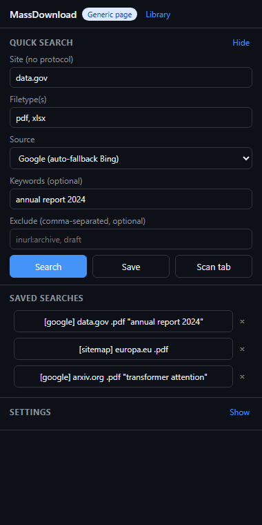
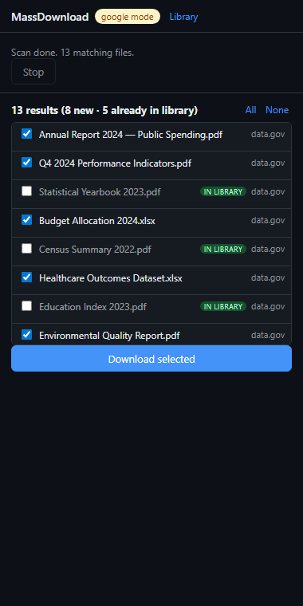
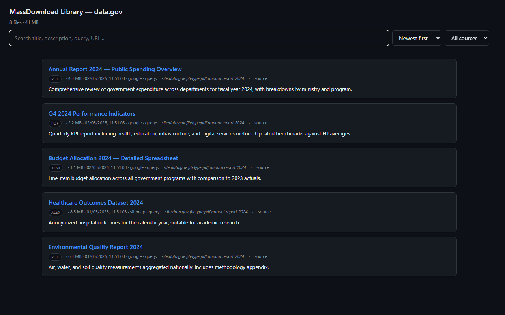

<div align="center">

# MassDownload

**A Chrome/Edge extension that scrapes Google, Bing, or sitemap.xml — across all pages — and bulk-downloads the files it finds, into a searchable local library.**

[](https://opensource.org/licenses/MIT)
[](https://github.com/bogdanpricop/MassDownload/releases/latest)
[](https://developer.chrome.com/docs/extensions/mv3/intro/)
[](https://www.typescriptlang.org/)
[](https://github.com/bogdanpricop/MassDownload)

[Install](#install) • [How it works](#how-it-works) • [Comparison](#comparison) • [Use cases](#use-cases) • [FAQ](#faq) • [Contributing](#contributing)

</div>

---

## What it does

You search Google for `site:example.gov filetype:pdf` and you want every PDF — across **all** result pages, not just the first ten. Without MassDownload you'd:

1. Open Google
2. Type the query
3. Click each PDF
4. Paginate through 10+ Google pages
5. Repeat for the next site

With MassDownload:

1. Click the toolbar icon → side panel opens
2. Site = `example.gov`, filetype = `pdf` → **Search**
3. All matching PDFs across all result pages are listed (with title and snippet)
4. **Download selected** → files saved in parallel to `Downloads/MassDownload/example.gov/`
5. Click **Library** → searchable HTML index of everything you've downloaded from that site

Saved searches let you re-run a query in one click. Sitemap mode finds files Google never indexed. Auto-fallback to Bing handles Google CAPTCHA gracefully.

## Screenshots

<table>
<tr>
<td width="33%" align="center">
<br/>
<sub><b>Quick Search</b> — site, filetype, source, keywords. Saved searches re-run in one click.</sub>
</td>
<td width="33%" align="center">
<br/>
<sub><b>Scan results</b> — counter shows new vs already-downloaded. Files in the library are unchecked by default.</sub>
</td>
<td width="33%" align="center">
<br/>
<sub><b>Per-host library</b> — single-file HTML with live search, sort, filter, and <code>file://</code> links to local downloads.</sub>
</td>
</tr>
</table>

## Install

### Option A — Pre-built zip (no Node.js required) ⭐ recommended for users

1. Go to the [latest release](https://github.com/bogdanpricop/MassDownload/releases/latest).
2. Download `MassDownload-vX.Y.Z.zip` from the release assets.
3. Extract the archive somewhere stable (e.g. `C:\Users\you\Apps\MassDownload\`). **Don't pick a temp folder** — the browser keeps loading the extension from this path, so deleting the folder later breaks it.
4. Open the extension manager:
   - Chrome / Brave / Vivaldi: `chrome://extensions`
   - Microsoft Edge: `edge://extensions`
5. Toggle **Developer mode**.
6. Click **Load unpacked** and select the extracted folder (the one that contains `manifest.json`).
7. Pin the MassDownload icon to the toolbar — click it on any tab to open the side panel.

To update later: download the new zip, replace the folder contents, then click the **🔄 Reload** button on the extension's card.

### Option B — Build from source (developers)

Requires Node.js 18+ and npm.

```bash
git clone https://github.com/bogdanpricop/MassDownload.git
cd MassDownload
npm install
npm run build      # outputs dist/
```

Then in your browser: `chrome://extensions` → **Developer mode** → **Load unpacked** → select `dist/`.

### Dev with HMR

```bash
npm run dev
```

Reload the extension once after the first dev run; the side panel hot-reloads on changes.

---

## How it works

### Three scan sources

| Source | When to use | How |
|---|---|---|
| **Google** (default) | You want what Google indexes; site has no public sitemap | Builds `site:X filetype:Y` query, paginates with `start=0,10,20…` via a real background tab (loading→complete cycles, random 0.8–2s delays — looks like a human, not a bot). **Auto-falls back to Bing on CAPTCHA.** |
| **Bing** | Google rate-limited; alternative result set | Uses `bing.com/search?q=site:X filetype:Y`, paginates `first=1,51,101…&count=50`. Bing rarely CAPTCHAs. |
| **Sitemap.xml** | Site has a sitemap; you want **everything**, not just indexed pages | Reads `robots.txt` for `Sitemap:` directives, falls back to `/sitemap.xml`, `/sitemap_index.xml`. Recursively follows sitemap-index trees (max depth 3, max 50 sitemap files). Supports gzipped `.xml.gz`. |

The side panel also has a **Scan tab** button: parses the active tab as Google SERP if the URL matches, otherwise extracts every `a[href]` from the page (generic mode).

### Smart filename

When Google/Bing supply a result title, it's used as the filename instead of the URL pathname:

- URL `https://example.com/cgi-bin/dl.php?id=7821` + title `"Decision 312/2024"` → file `Decision 312_2024.pdf`
- URL `https://example.com/papers/foo.pdf` (no title) → file `foo.pdf`

### Per-host library

Every successfully downloaded file is recorded in `chrome.storage.local` with metadata: title, snippet description, query that found it, source engine, host, timestamp, size. After each download batch, a **standalone `library.html`** is regenerated for that host with:

- Live search across title, description, query, URL, filename
- Sort by date / title / size
- Filter by source engine
- Stats footer (`13 files · 4.5 MB`)
- Light/dark theme via `prefers-color-scheme`
- `file://` links to the local files
- External links to the original URL on the source site

The HTML is **fully self-contained** — open it from a USB stick, email it to a colleague, archive it. Zero external dependencies.

### Scan-time dedup

Results that are already in the library appear with an **"in library"** badge and are unchecked by default. You can still opt to re-download (e.g. to refresh content).

### Saving without per-file prompts

The extension calls `chrome.downloads.download({ saveAs: false })` so files save automatically. Default destination is `Downloads/MassDownload/{host}/`. Use the **Pick…** button to choose a different subfolder once via a system dialog — it sticks for all subsequent downloads.

If your browser still asks *"What do you want to do with X.pdf?"* for each file, the global setting needs disabling:

| Browser | Path | Setting |
|---|---|---|
| **Microsoft Edge** | `edge://settings/downloads` | *Ask me what to do with each download* |
| **Google Chrome** | `chrome://settings/downloads` | *Ask where to save each file before downloading* |
| **Brave / Vivaldi** | `brave://settings/downloads` / `vivaldi://settings/downloads` | same as Chrome |

The side panel has an **Open browser download settings** link that takes you straight there.

---

## Comparison

How does MassDownload stack up against alternatives?

| Tool | SERP autopagination | Anti-CAPTCHA strategy | Sitemap fallback | Library + search | Browser session | Free |
|---|:-:|:-:|:-:|:-:|:-:|:-:|
| **MassDownload** | ✅ | ✅ Real tab + delays | ✅ | ✅ Per-host HTML | ✅ | ✅ |
| **DownThemAll!** | ❌ Per-page only | n/a | ❌ | ❌ | ✅ | ✅ |
| **Simple Mass Downloader** | ❌ URL templates only | n/a | ❌ | ❌ | ✅ | ✅ |
| **Web Scraper.io** | ⚠️ DIY config | ❌ | ⚠️ DIY | ❌ | ✅ | Free tier |
| **wget --recursive** | ❌ | n/a | ⚠️ Manual | ❌ | ❌ | ✅ |
| **SerpAPI + script** | ✅ via API | ✅ | ❌ | DIY | ❌ | ❌ ($50+/mo) |

**Pick MassDownload if** you want a single-click flow from "search a domain" to "files on disk + searchable library", without paying for a SaaS or scripting bash.

**Pick DownThemAll** if you have a single page already open and just want to bulk-pull all links from it.

**Pick wget** for a full recursive site mirror in CLI.

**Pick SerpAPI** if you need this at industrial scale and don't mind paying.

---

## Use cases

### 📚 Researchers / journalists
Collect every public PDF from a government or institutional site for analysis. Sitemap mode catches documents the search engines don't surface.

### ⚖️ Legal / paralegal
Scrape court decisions, executor notices, notary records from public registries. Per-host library with description snippets makes finding a specific case fast.

### 🔍 OSINT
Quick intel sweep on a domain — what documents has this site published? Sitemap fallback works on small sites with poor Google coverage.

### 👨‍💻 Developers
Open-source MV3 reference: side panel + offscreen DOMParser + service-worker download queue + tab-based stealth scraping. Fork and extend.

---

## Project layout

```
src/
├── background.ts             # service worker — scan dispatcher + download queue
├── offscreen.html / .ts      # DOMParser host (MV3 service workers can't use DOMParser directly)
├── sidepanel/
│   ├── sidepanel.html        # Quick Search form, saved list, results, progress
│   ├── sidepanel.ts          # UI state + long-lived port to background
│   ├── sidepanel.css
│   └── folderPicker.ts       # one-shot Save-As dialog → relative subfolder
├── parsers/
│   ├── google.ts             # SERP URL helpers (extraction runs in-tab)
│   ├── bing.ts               # SERP parsing + /ck/a?u= base64 redirect unwrap
│   ├── sitemap.ts            # urlset / sitemapindex extraction + robots.txt
│   ├── queryBuilder.ts       # site/filetype/keywords → search URL
│   └── filters.ts            # extension match, canonicalize/dedup, smart filename
├── library/
│   ├── manifest.ts           # CRUD on chrome.storage.local['library']
│   └── htmlGenerator.ts      # standalone HTML view (search/sort/filter)
├── downloader.ts             # parallel queue + cancel + one-shot retry
├── messages.ts               # typed messages (sidepanel ↔ background ↔ offscreen)
├── storage.ts                # settings + saved searches
└── types.ts                  # LinkInfo, LibraryEntry, SearchQuery, Settings
```

## Settings

| Field | Default | Range / notes |
|---|---|---|
| Filetype(s) | `pdf` | Comma-separated. Used as both query filter (`filetype:pdf`) and post-scan extension filter |
| Source | Google | google / sitemap / bing |
| Keywords | empty | Free text appended to query |
| Exclude | empty | Comma-separated, each becomes `-term` in query |
| Parallel downloads | 5 | 1 – 20 |
| Max pages | 20 | 1 – 50 (also caps sitemap files visited) |
| Subfolder | `MassDownload/{host}` | Supports `{host}` placeholder |
| Saved searches | (managed via UI) | up to 30 stored |

All persist via `chrome.storage.local`.

---

## Limitations

- **Google CAPTCHA on heavy use**: real-tab navigation reduces but doesn't eliminate it. When you hit it, the tab is brought to the foreground for you to solve, then the next scan reuses that tab with a clean session.
- **Sitemaps may lie**: some sites list URLs that 404. Failed downloads are reported in the log; the queue continues.
- **Files behind login**: downloads follow your existing browser cookies — works only if you're already logged in to that site.
- **JavaScript-only sites**: if a page renders link lists purely in JS, sitemap mode is the only reliable option.
- **Resume after crash**: not implemented. If the service worker is killed mid-queue, in-flight downloads continue (Chrome owns them) but queue progress is lost.

## Permissions

| Permission | Why it's needed |
|---|---|
| `sidePanel` | Side panel UI |
| `downloads` | Save files, regenerate library.html |
| `activeTab` + `scripting` | Read links from the current tab; in-page Google SERP extraction |
| `storage` | Persist settings, saved searches, library manifest |
| `offscreen` | Run `DOMParser` on Bing HTML / sitemap XML |
| `tabs` | Read active tab URL, manage scan tab |
| `<all_urls>` host | Fetch Google in any locale, Bing, any site's robots.txt and sitemap |

**No telemetry. No remote config. No data leaves your browser** except the HTTP requests required to fetch search pages and download the files you select.

---

## FAQ

**Q: Does this work on Firefox?**
A: Not yet. Manifest V3 + side panel APIs need adaptation. PRs welcome.

**Q: Will this get me in trouble with Google?**
A: It uses your real browser session for SERP scraping (no API key, no rotation). At low volume (a few sites a day) you'll rarely hit CAPTCHA. At high volume Google may temporarily challenge you — solve it in the tab the extension surfaces, then continue.

**Q: Does it scrape sites behind login?**
A: It downloads via your existing browser cookies, so if you're logged in, yes. The extension itself never asks for or stores credentials.

**Q: Where does the library data live?**
A: `chrome.storage.local['library']` — a flat map keyed by canonical URL. The HTML view at `Downloads/MassDownload/{host}/library.html` is regenerated from this on each download batch. Wipe by uninstalling the extension or via the storage inspector in DevTools.

**Q: Can I edit titles or add tags from the library HTML?**
A: Not yet — the HTML is read-only. Sync-back-to-extension is on the roadmap.

---

## Contributing

Issues and PRs welcome. See [CONTRIBUTING.md](CONTRIBUTING.md).

For a feature idea or bug, [open an issue](https://github.com/bogdanpricop/MassDownload/issues/new/choose).

## License

[MIT](LICENSE) © 2026 Bogdan Pricop
